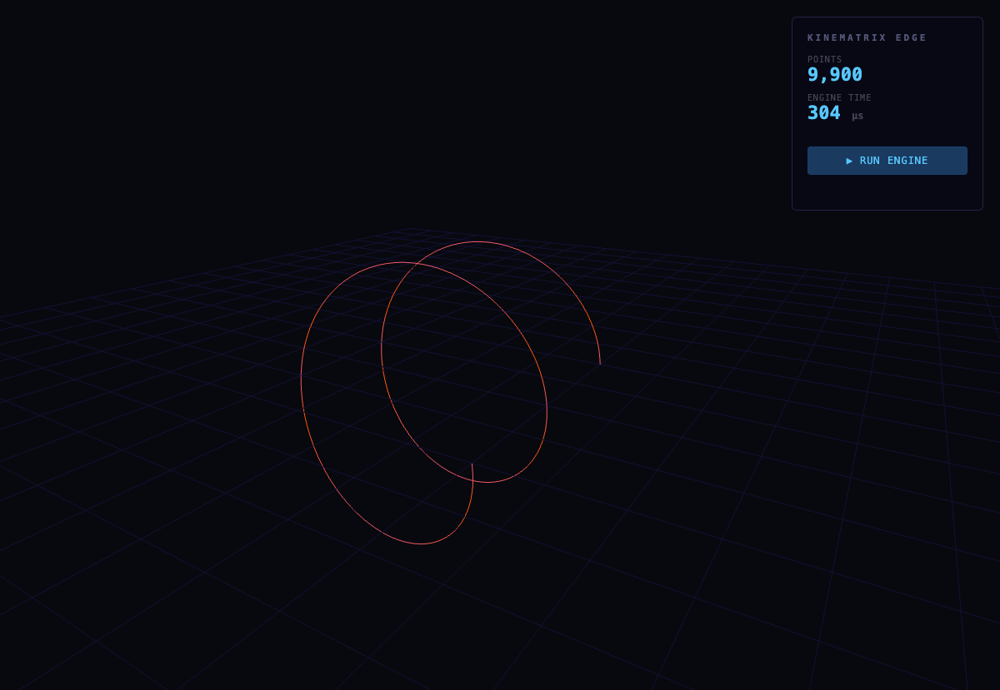
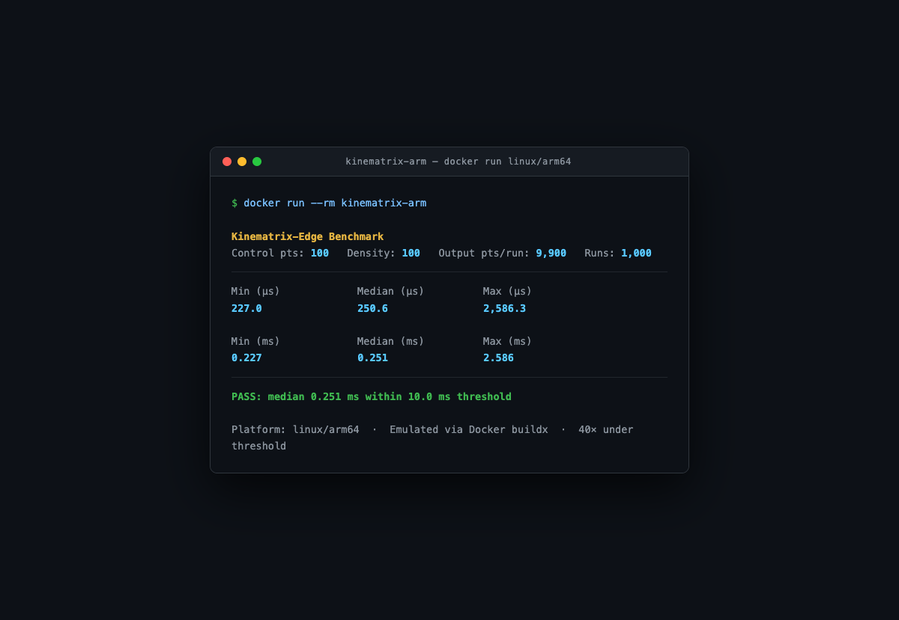

# Kinematrix-Edge: 5-Axis Trajectory Interpolator

A lightweight, headless C++ engine that converts a list of 3D Cartesian waypoints into a smooth, time-optimised 5-axis kinematic trajectory — benchmarked on emulated ARM64 edge hardware. A FastAPI/Three.js dashboard renders the result interactively.

**Key proof point:** 9,900 interpolated points processed in **~0.25 ms on emulated ARM64** (Docker `linux/arm64`), well under the 10 ms industrial threshold.



*9,900-point helix trajectory. Colour encodes tilt magnitude √(A²+B²): blue = low tilt (home orientation), red = high tilt (head angled away from +Z). Stats panel shows live point count and engine latency in µs.*

---

## Table of Contents

1. [Architecture Overview](#architecture-overview)
2. [Full Pipeline](#full-pipeline)
3. [Math: Cubic Spline Interpolation](#math-cubic-spline-interpolation)
4. [Math: Inverse Kinematics — Tangent-Derived Tilt Angles](#math-inverse-kinematics--tangent-derived-tilt-angles)
5. [Math: Motor Step Mapping](#math-motor-step-mapping)
6. [Data Types](#data-types)
7. [Repository Layout](#repository-layout)
8. [Build & Run](#build--run)
9. [ARM Cross-Compile Benchmark](#arm-cross-compile-benchmark)
10. [Dashboard](#dashboard)
11. [Testing](#testing)

---

## Architecture Overview

```
┌─────────────────────────────────────────────────────────┐
│                    libkinematrix (static)                │
│                                                         │
│   CubicSpline              IKSolver                     │
│   ┌──────────────┐         ┌─────────────────┐          │
│   │ Thomas alg.  │         │ tangent → A,B   │          │
│   │ O(N) solve   │──────▶  │ angles → motors │          │
│   │ analytic     │         │                 │          │
│   │ tangent      │         └─────────────────┘          │
│   └──────────────┘                                      │
└───────────────┬─────────────────────────────────────────┘
                │
        ┌───────┴──────────┐
        │                  │
┌───────▼──────┐   ┌───────▼──────┐
│ kinematrix   │   │ kinematrix   │
│ _cli         │   │ _bench       │
│              │   │              │
│ CSV → JSON   │   │ timing       │
│ pipeline     │   │ harness      │
└───────┬──────┘   └──────────────┘
        │
   trajectory.json
        │
┌───────▼──────────────────────────┐
│  FastAPI dashboard               │
│  /api/trajectory  /api/run       │
│         │                        │
│  Three.js scene                  │
│  orbit controls + tilt gradient  │
└──────────────────────────────────┘
```

Three CMake targets — one static library, two binaries — keep math completely isolated from I/O. The benchmark binary links only the library, so its timing numbers are pure computation with no file or network overhead.

---

## Full Pipeline

```
data/sample_path.csv
      │
      │  100 rows of (X, Y, Z) — 3D waypoints
      ▼
┌─────────────┐
│  CsvParser  │  Reads lines, skips header, returns vector<Point3>
└──────┬──────┘
       │
       │  std::vector<Point3>  (100 control points)
       ▼
┌──────────────┐
│ CubicSpline  │  Constructs natural cubic spline per axis (X, Y, Z)
│              │  Solves tridiagonal system via Thomas algorithm — O(N)
│  .interpolate│  Evaluates (N-1)×density = 9,900 SplinePoints
│  (density)   │  Each SplinePoint carries: pos + analytic tangent
└──────┬───────┘
       │
       │  std::vector<SplinePoint>  (9,900 points with tangent vectors)
       ▼
┌────────────┐
│  IKSolver  │  For each SplinePoint:
│            │    1. Normalise tangent vector T = (tx, ty, tz)
│  .solve()  │    2. Derive tilt angles:
│            │         B = atan2(tx, tz)   [tilt around Y-axis]
│            │         A = atan2(-ty, √(tx²+tz²))  [tilt around X-axis]
│            │    3. Map (X,Y,Z,A,B) → integer motor steps
└──────┬─────┘
       │
       │  std::vector<IKResult>  {a_deg, b_deg, MotorPoint{m1..m5}}
       ▼
┌─────────────┐
│ JSON writer │  Serialises meta (count, duration_us) + points array
└──────┬──────┘
       │
       ▼
output/trajectory.json
       │
       ▼
┌────────────────┐
│ FastAPI        │  GET /api/trajectory  →  serves JSON
│ /api/run       │  POST /api/run        →  re-runs CLI as subprocess
└───────┬────────┘
        │
        ▼
┌─────────────────────────────┐
│  Three.js (browser)         │
│  BufferGeometry Line        │
│  vertex colour: blue→red    │
│  by tilt magnitude √(A²+B²) │
│  OrbitControls: drag/zoom   │
└─────────────────────────────┘
```

---

## Math: Cubic Spline Interpolation

### What it does

Given N discrete waypoints (control points), the spline produces a smooth continuous curve that passes through every point, with continuous first and second derivatives. This eliminates the sharp corners and velocity discontinuities you would get from simple linear interpolation — essential for smooth machine motion.

### Natural cubic spline

For N control points `y[0], y[1], ..., y[N-1]` uniformly parameterised at `t = 0, 1, ..., N-1`, the spline on segment `i` (for `t ∈ [i, i+1]`, local `u = t - i ∈ [0,1)`) is the cubic polynomial:

```
S_i(u) = a + b·u + c·u² + d·u³
```

The coefficients are derived from the second derivatives M[i] at each knot:

```
a = y[i]
b = (y[i+1] - y[i]) - (2·M[i] + M[i+1]) / 6
c = M[i] / 2
d = (M[i+1] - M[i]) / 6
```

**Natural boundary conditions:** M[0] = M[N-1] = 0 (zero curvature at the endpoints).

### Solving for the second derivatives — Thomas algorithm

The M values at interior knots satisfy the tridiagonal linear system (one equation per interior knot):

```
M[i-1] + 4·M[i] + M[i+1] = 6·(y[i-1] - 2·y[i] + y[i+1])
```

In matrix form for M[1]..M[N-2]:

```
┌ 4  1          ┐ ┌ M[1]   ┐   ┌ r[0] ┐
│ 1  4  1       │ │ M[2]   │   │ r[1] │
│    1  4  1    │ │  ...   │ = │  ... │
│       ...     │ │        │   │      │
└          1  4 ┘ └ M[N-2] ┘   └ r[m] ┘

where r[i] = 6·(y[i] - 2·y[i+1] + y[i+2])
```

The **Thomas algorithm** (tridiagonal matrix algorithm) solves this in O(N) time — critical for real-time edge performance.

**Forward sweep** (eliminates the sub-diagonal):
```
c'[0] = 1/4
d'[0] = r[0]/4

for i = 1..m-1:
    denom  = 4 - c'[i-1]
    c'[i]  = 1 / denom
    d'[i]  = (r[i] - d'[i-1]) / denom
```

**Back substitution** (recovers M[i]):
```
sol[m-1] = d'[m-1]

for i = m-2..0:
    sol[i] = d'[i] - c'[i]·sol[i+1]
```

This runs once per axis (X, Y, Z) during spline construction. The O(N) cost means a 10,000-point spline takes the same order of operations as a 100-point one, scaled linearly.

### Analytic tangent

The tangent (first derivative) at segment `i`, parameter `u` is derived directly from the same coefficients — no finite differences, no approximation error:

```
S'_i(u) = b + 2c·u + 3d·u²
```

Each axis is differentiated independently. The three components `(S'_x, S'_y, S'_z)` form the tangent vector passed to the IK solver.

### Interpolation output

```
interpolate(density):
  for each segment i in [0, N-2]:
    for j in [0, density):
      u = j / density          ← local parameter in [0, 1)
      pos     = (S_x(u), S_y(u), S_z(u))
      tangent = (S'_x(u), S'_y(u), S'_z(u))
      emit SplinePoint{pos, tangent}

total output = (N-1) × density points
```

For 100 control points at `--density 100`: (100-1) × 100 = **9,900 output points**.

---

## Math: Inverse Kinematics — Tangent-Derived Tilt Angles

### Machine model

The machine has 5 axes:
- **X, Y, Z** — linear gantry drives (lead-screw, stepper motors)
- **A** — rotary tilt of the cutting head around the X-axis
- **B** — rotary tilt of the cutting head around the Y-axis

The tool home position points along **+Z**. At home, A = B = 0.

The input CSV provides only X, Y, Z waypoints. The A and B angles are **computed** by aligning the tool with the path tangent — the laser head automatically orients to follow the trajectory direction.

### Tangent normalisation

The raw tangent from the spline has arbitrary magnitude (it is `dS/dt`, not a unit vector). The IK solver normalises it first:

```
len = √(tx² + ty² + tz²)

if len < 1e-10:            ← degenerate (zero tangent)
    T = (0, 0, 1)          ← fall back to home orientation
else:
    T = (tx/len, ty/len, tz/len)
```

### Deriving A and B from the tangent

To rotate the tool from its home direction (0, 0, 1) to align with normalised tangent T = (tx, ty, tz), two sequential rotations are applied:

**B — rotation around Y-axis** (yaw in the XZ-plane):
```
B = atan2(tx, tz)
```
This sweeps the tool toward the X-component of T. When T = (0,0,1) (home), B = 0. When T = (1,0,0) (full X), B = 90°.

**A — rotation around X-axis** (pitch out of the XZ-plane):
```
xz_len = √(tx² + tz²)
A = atan2(-ty, xz_len)
```
This tilts the tool into the Y-component of T. When T lies in the XZ-plane (ty = 0), A = 0. When T = (0,-1,0) (full -Y), A = 90°.

**Degenerate case** (tangent is purely along Y, xz_len ≈ 0): B is undefined geometrically, so it is clamped to 0.

### Verification table

| Tangent direction | B (°) | A (°) | Meaning |
|---|---|---|---|
| (0, 0, 1) | 0 | 0 | Home — no tilt |
| (1, 0, 0) | 90 | 0 | Full X tilt |
| (0, -1, 0) | 0 | 90 | Full -Y tilt |
| (1, 0, 1)/√2 | 45 | 0 | Diagonal XZ |
| (0, 0, -1) | 180 | 0 | Reversed Z |

---

## Math: Motor Step Mapping

After angles A, B are known, all five motor positions are computed by a linear scaling from physical units to integer step counts:

```
Linear axes (mm → steps):
  m1 = round(X / lead_x × steps_per_rev)
  m2 = round(Y / lead_y × steps_per_rev)
  m3 = round(Z / lead_z × steps_per_rev)

Rotary axes (degrees → steps):
  m4 = round(A_deg / gear_a × steps_per_rev)
  m5 = round(B_deg / gear_b × steps_per_rev)
```

Default `MachineConfig` (easily overridden):

| Parameter | Value | Meaning |
|---|---|---|
| `lead_x/y/z` | 5.0 mm/rev | Lead-screw pitch |
| `gear_a/b` | 360 °/rev | 1:1 rotary drive |
| `steps_per_rev` | 200 | Standard 1.8° stepper |

Example: X = 5 mm → m1 = round(5 / 5 × 200) = **200 steps**.

---

## Data Types

Defined in `lib/include/kinematrix/types.hpp`:

```cpp
struct Point3 { double x, y, z; };       // 3D world position (mm)

struct SplinePoint {
    Point3 pos;       // interpolated position
    Point3 tangent;   // analytic first derivative (not normalised)
};

struct MachineConfig {
    double lead_x, lead_y, lead_z;  // mm per motor revolution
    double gear_a, gear_b;          // degrees per motor revolution
    long   steps_per_rev;           // steps per motor revolution
};

struct MotorPoint {
    long m1, m2, m3, m4, m5;        // integer step counts
};

struct IKResult {
    double a_deg, b_deg;            // tilt angles in degrees
    MotorPoint motors;              // motor step positions
};
```

---

## Repository Layout

```
kinematrix_edge/
├── CMakeLists.txt              # root: C++17, FetchContent Catch2, subdirs
├── Dockerfile                  # linux/arm64 benchmark image
├── cmake/
│   └── toolchain-arm.cmake     # ARM cross-compile toolchain
├── lib/                        # libkinematrix (static library)
│   ├── include/kinematrix/
│   │   ├── types.hpp           # Point3, SplinePoint, MachineConfig, MotorPoint, IKResult
│   │   ├── spline.hpp          # CubicSpline declaration
│   │   └── ik.hpp              # IKSolver declaration
│   └── src/
│       ├── spline.cpp          # Thomas algorithm + analytic tangent
│       └── ik.cpp              # tilt-angle derivation + motor mapping
├── cli/                        # kinematrix_cli executable
│   ├── csv_parser.hpp/cpp      # header-aware CSV reader
│   └── main.cpp                # arg parsing, pipeline, JSON writer
├── benchmark/                  # kinematrix_bench executable
│   └── bench_main.cpp          # 1000-iteration timing harness
├── tests/                      # Catch2 unit tests (CTest)
│   ├── test_spline.cpp
│   ├── test_ik.cpp
│   └── test_csv.cpp
├── dashboard/                  # Python FastAPI + Three.js
│   ├── main.py                 # /  /api/trajectory  /api/run
│   ├── requirements.txt
│   └── static/
│       ├── index.html          # dark-themed UI
│       └── app.js              # Three.js scene, orbit controls
├── data/
│   └── sample_path.csv         # 100-point helix (generated)
└── output/
    └── trajectory.json         # engine output (gitignored)
```

---

## Build & Run

### Prerequisites

- CMake 3.20+
- C++17 compiler (GCC 11+ or Clang 13+)
- Python 3.11+
- Docker (for ARM benchmark only)

### Native build

```bash
mkdir build && cd build
cmake .. -DCMAKE_BUILD_TYPE=Release
cmake --build . -j$(nproc)
```

This produces:
- `build/cli/kinematrix_cli`
- `build/benchmark/kinematrix_bench`
- `build/tests/test_kinematrix`

### Run the CLI

```bash
build/cli/kinematrix_cli data/sample_path.csv output/trajectory.json --density 100
# Done: 9900 points in 282 µs
```

`--density N` sets interpolated points per spline segment (default 100). A 100-row CSV at density 100 produces (100-1)×100 = 9,900 output points.

### Run the benchmark

```bash
build/benchmark/kinematrix_bench
```

```
Kinematrix-Edge Benchmark
Control pts: 100  Density: 100  Output pts/run: 9900  Runs: 1000

Min (us)       Median (us)    Max (us)
175.5          193.5          269.2

Min (ms)       Median (ms)    Max (ms)
0.175          0.194          0.269

PASS: median 0.194 ms within 10.0 ms threshold
```

Exits with code 0 on PASS, code 1 on FAIL — CI-compatible.

### Run unit tests

```bash
cd build && ctest -V
# 100% tests passed, 0 tests failed out of 17
```

---

## ARM Cross-Compile Benchmark

The Dockerfile builds and runs the benchmark inside an emulated `linux/arm64` container (Raspberry Pi 4 / modern edge boards):

```bash
docker buildx build --platform linux/arm64 --load -t kinematrix-arm .
docker run --rm kinematrix-arm
```

Results on Apple Silicon Mac emulating ARM64:



| | Min | Median | Max |
|---|---|---|---|
| µs | 227 | 251 | 2,586 |
| ms | 0.227 | 0.251 | 2.586 |

**PASS — median 0.251 ms, 40× under the 10 ms threshold.**

The pipeline (Thomas solve + 9,900-point evaluation + IK) completes in well under 1 ms even on emulated ARM edge hardware.

---

## Dashboard

### Start

```bash
# Step 1 — generate trajectory
build/cli/kinematrix_cli data/sample_path.csv output/trajectory.json --density 100

# Step 2 — start server
cd dashboard
python3 -m venv .venv && source .venv/bin/activate
pip install -r requirements.txt
uvicorn main:app --host 0.0.0.0 --port 8000
```

Open **http://localhost:8000**.

### API endpoints

| Endpoint | Method | Description |
|---|---|---|
| `/` | GET | Serves the Three.js dashboard HTML |
| `/api/trajectory` | GET | Returns `output/trajectory.json` as JSON |
| `/api/run` | POST | Runs `kinematrix_cli` as subprocess, returns `{duration_us, count}` |

`POST /api/run` body:
```json
{ "input": "data/sample_path.csv", "density": 100 }
```

### Three.js visualisation

- **3D line** rendered from `(x, y, z)` coordinates
- **Vertex colour gradient** — each vertex is coloured blue→red by tilt magnitude `√(A² + B²)`, making the IK output immediately visible
- **OrbitControls** — left-drag to rotate, scroll to zoom, right-drag to pan
- **Stats panel** — shows point count and engine time in µs
- **RUN ENGINE button** — calls `POST /api/run` and reloads the scene without a page refresh

---

## Testing

17 unit tests across three files, run with Catch2 v3 via CTest:

| File | Tests | What they cover |
|---|---|---|
| `test_spline.cpp` | 6 | Linear interpolation accuracy, tangent direction, collinear points, output size, `invalid_argument` on <2 points |
| `test_ik.cpp` | 6 | Home orientation (A=B=0), +X/−Y tangents, diagonal tangents, motor step arithmetic, degenerate zero tangent |
| `test_csv.cpp` | 5 | Header detection, no-header parsing, trailing newline, too-few columns, non-numeric values |

All tests are TDD — written before the implementation and verified to fail first.
